# คู่มือติดตั้ง Yomitan + ใช้ Shima Bird Connect

สะสมคำศัพท์ภาษาญี่ปุ่นจากเบราว์เซอร์เข้า **Shima Bird** เพื่อทบทวนด้วยระบบ SRS — ผ่านส่วนเสริมฟรี [Yomitan](https://yomitan.wiki/)

ขณะอ่านเว็บญี่ปุ่น กด Shift ค้างแล้วเลื่อนเมาส์ไปที่คำ → กด **＋** ใน Yomitan → คำจะถูกสะสมเข้า inbox ในแอป พร้อมนำเข้าเป็นการ์ดทบทวน

> 🇬🇧 English: [shima-bird-connect-en.md](shima-bird-connect-en.md)

---

**1. ติดตั้ง Yomitan** (รองรับ Chrome, Firefox และ Microsoft Edge)
ไปที่ https://yomitan.wiki — มีลิงก์ติดตั้งครบทั้ง 3 เบราว์เซอร์ด้านใน เลือกเบราว์เซอร์ที่ใช้

**2.** กด **Add to Chrome** (หรือเบราว์เซอร์ที่ใช้) แล้วกด **เพิ่มส่วนขยาย**

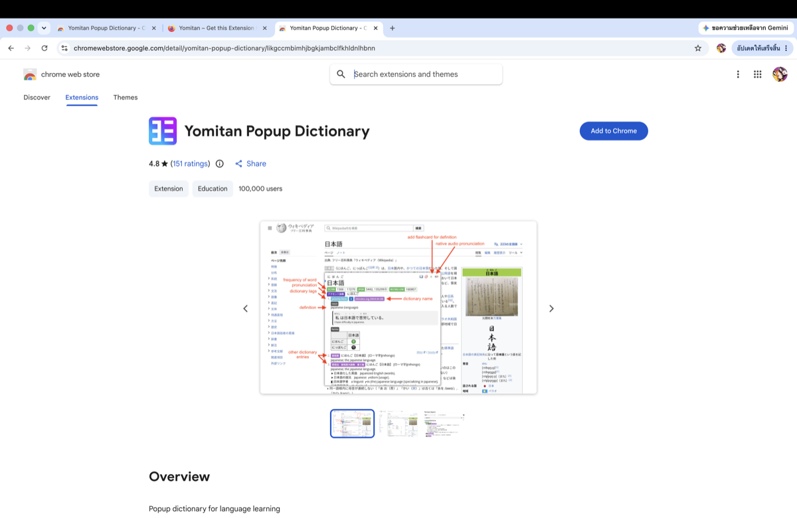

**3.** ติดตั้งเสร็จจะเปิดหน้า **Welcome to Yomitan** ขึ้นมาเอง

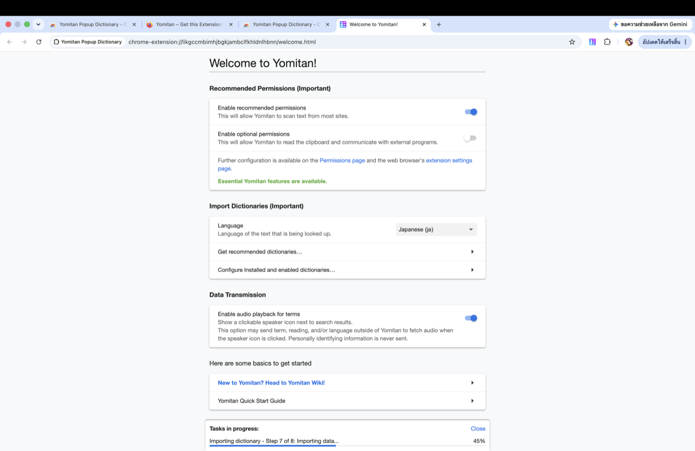

**4.** ที่หัวข้อ **Import Dictionaries** เลือก **Get recommended dictionaries…** แล้วกด **Download** ทุกอัน (หรือเฉพาะอันที่ต้องการ เช่น Jitendex)

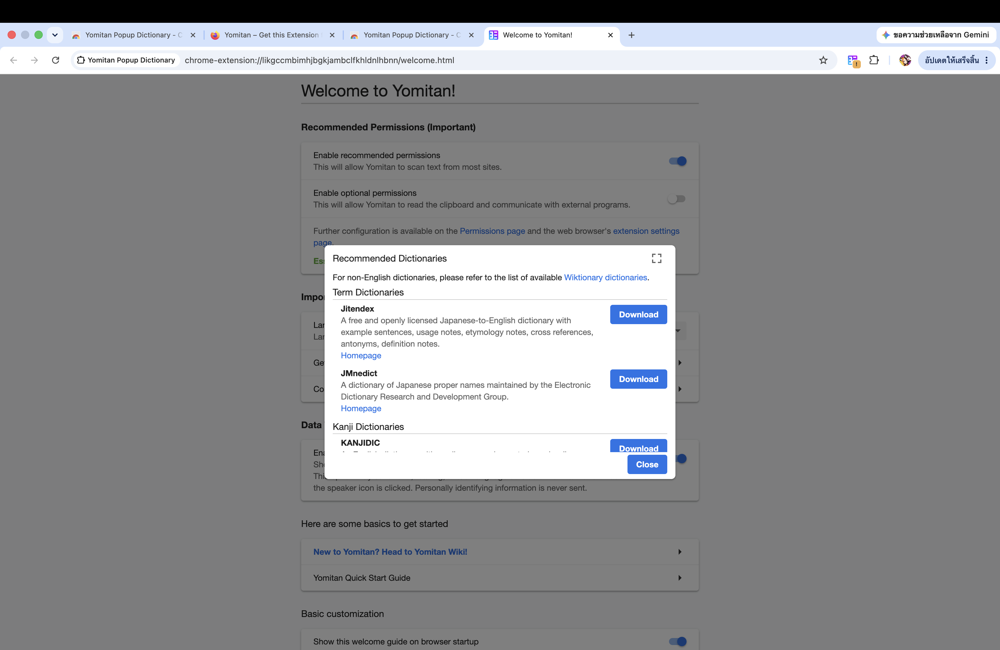

**5.** ปกติดิกชันนารีที่โหลดมาจะ **เปิดใช้งาน (Enable) อัตโนมัติ** อยู่แล้ว — ถ้าอยากเช็ก/จัดการ เลือก **Configure Installed and enabled dictionaries…** จะเห็นรายการพร้อม toggle **All** เปิดอยู่

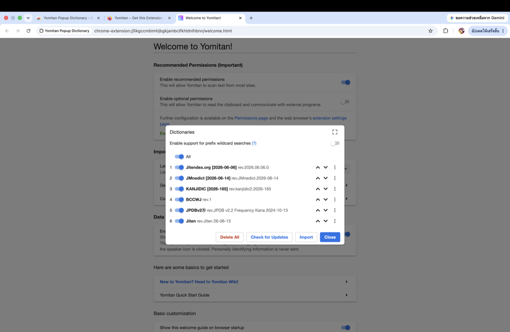

> ✅ ถึงตรงนี้ Yomitan สแกนคำศัพท์ได้แล้ว — แต่ยังส่งเข้า Shima Bird ไม่ได้ ทำขั้นต่อไป

**6.** กดไอคอน Yomitan บน toolbar → จะมี popup ขึ้น → กดรูป **ฟันเฟือง** เพื่อเข้า Settings → เลือกแท็บ **Anki**

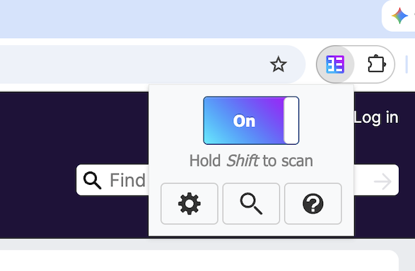

> ถ้าไม่เห็นไอคอน Yomitan: กดรูป **ส่วนขยาย (จิ๊กซอว์)** บน toolbar แล้ว **ปักหมุด** Yomitan ไว้ — ถ้ายังกดไม่ขึ้น ลอง **สลับแท็บ** ดูก่อน

**7.** เปิดแอป Shima Bird → กดเมนูขวาล่าง → **Shima Bird Connect** → **สร้างลิงก์เชื่อมต่อ** → คัดลอกลิงก์ไปวางในช่อง **AnkiConnect server address** ของ Yomitan (แทนค่า `http://127.0.0.1:8765` เดิม)

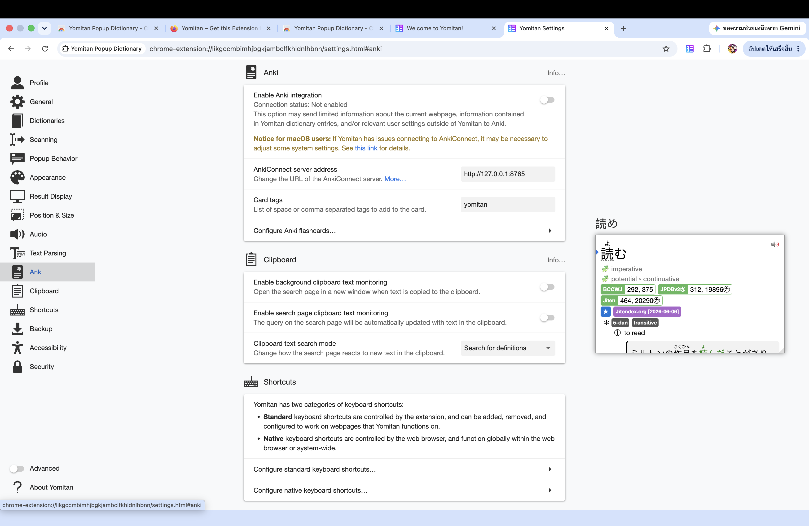

ฝั่งแอป — หา Shima Bird Connect (ใต้ Immersion) แล้วสร้างลิงก์ → คัดลอก:

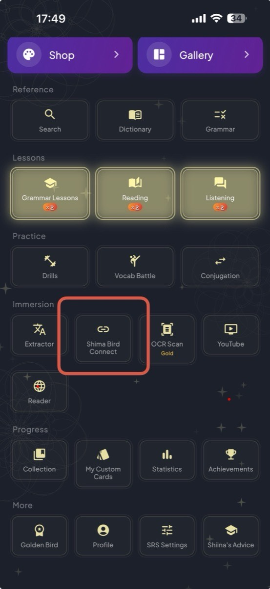
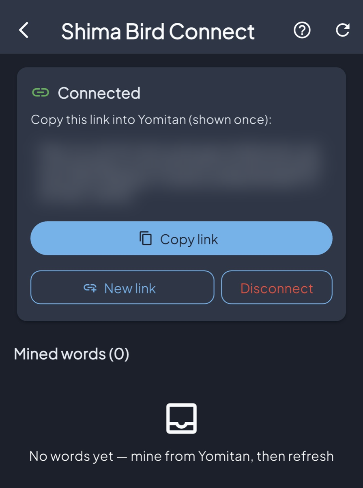

**8.** กด **Enable Anki Connection** — ถ้าสำเร็จจะขึ้น **Connected**
_(ถ้า Fail: กดสร้างลิงก์ใหม่อีกครั้งก่อนเอาไปวาง แล้ว retoggle อีกรอบ)_

**9.** กด **Configure Anki Flashcard** เลือก **Deck : Shima Bird Inbox**, **Model : Shima Bird** แล้วกด **Close** — ช่อง field จะถูก map ให้อัตโนมัติ (Expression / Reading / Glossary / Sentence / URL)

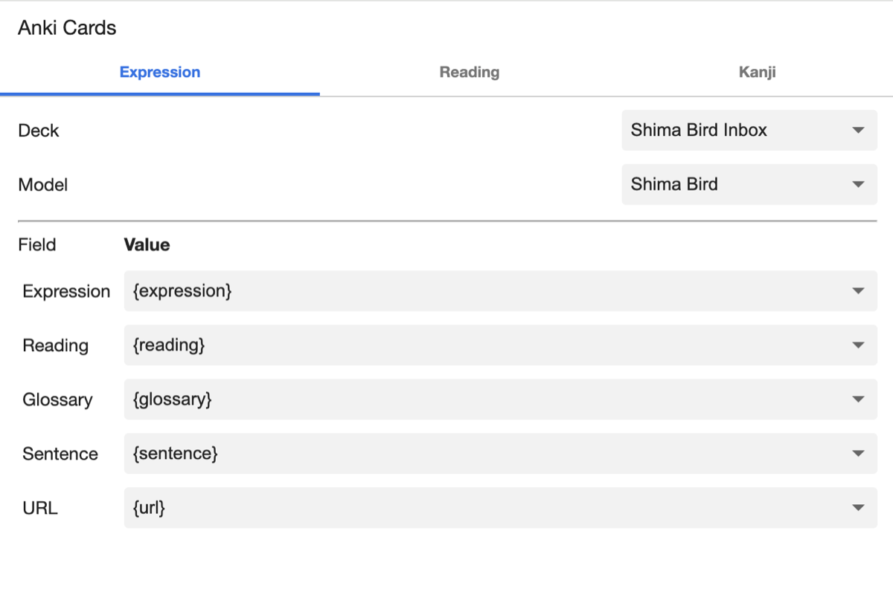

**10.** เข้าเว็บภาษาญี่ปุ่นที่ต้องการ กด **Shift** ค้างขณะเลื่อนเมาส์ไปที่คำ → จะขึ้นคำแปลพร้อมปุ่ม **＋ สีเขียว** มุมขวาบน → กดปุ่มนั้น คำจะถูกส่งเข้า Server ของ Shima Bird

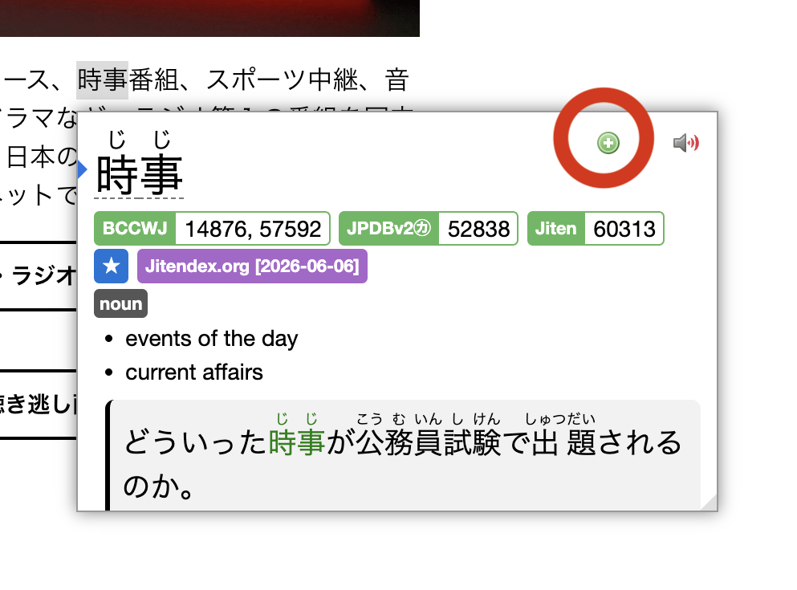

**11.** กด **Refresh** ที่ Shima Bird Connect จะเห็นคำที่ mine เข้ามา → กดปุ่ม **＋** เพื่อ import → เปิดหน้า **Create New Card** ที่เติมคำ / คำอ่าน / ความหมาย / แยก kanji ให้แล้ว

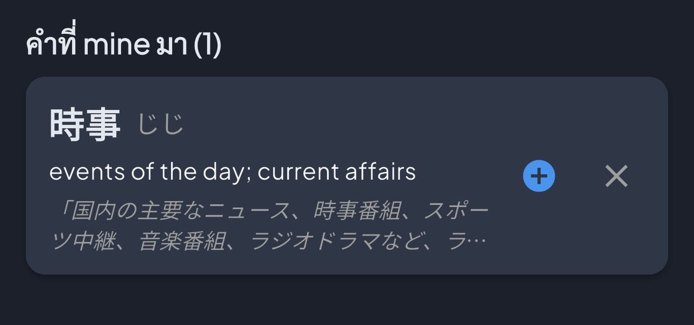
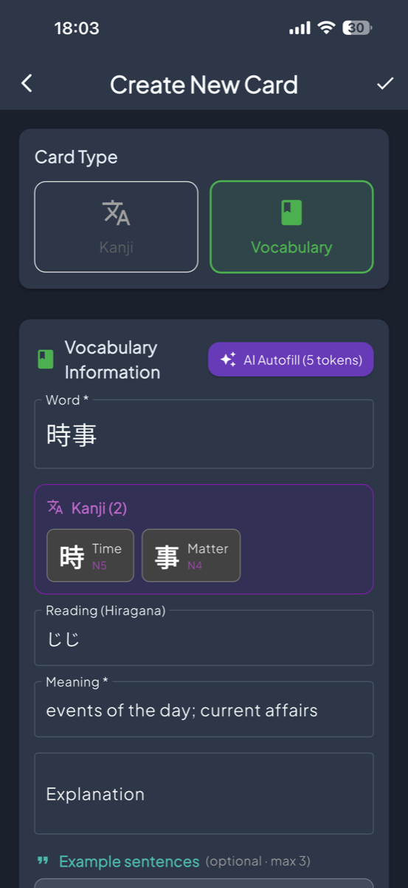

_(ไม่บังคับ)_ ถ้าต้องการ กด **AI Autofill** เพื่อเติม explanation + **ประโยคตัวอย่าง (สูงสุด 3)** อัตโนมัติได้

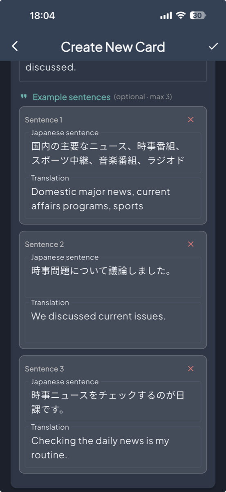

**12.** เลือก **Deck** + **Study Mode** ด้านล่าง แล้วกด **Add to Quick Study** → เริ่มเรียนได้เลย (หรือ **Create Only** เก็บไว้ก่อน)

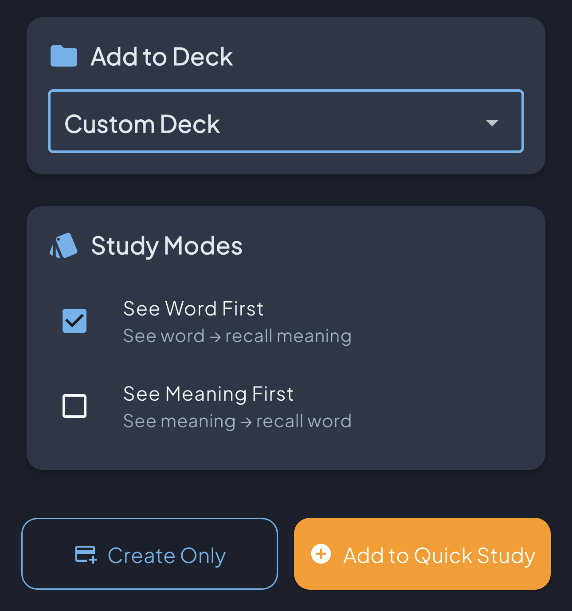

### ลิมิตการใช้งาน

|              |                                  |
| ------------ | -------------------------------- |
| สะสมต่อวัน   | 300 คำ (รีเซ็ตเที่ยงคืนเวลาไทย)  |
| ความจุ inbox | 20 คำ — สะสมเกินจะลบคำเก่าสุดออก |
